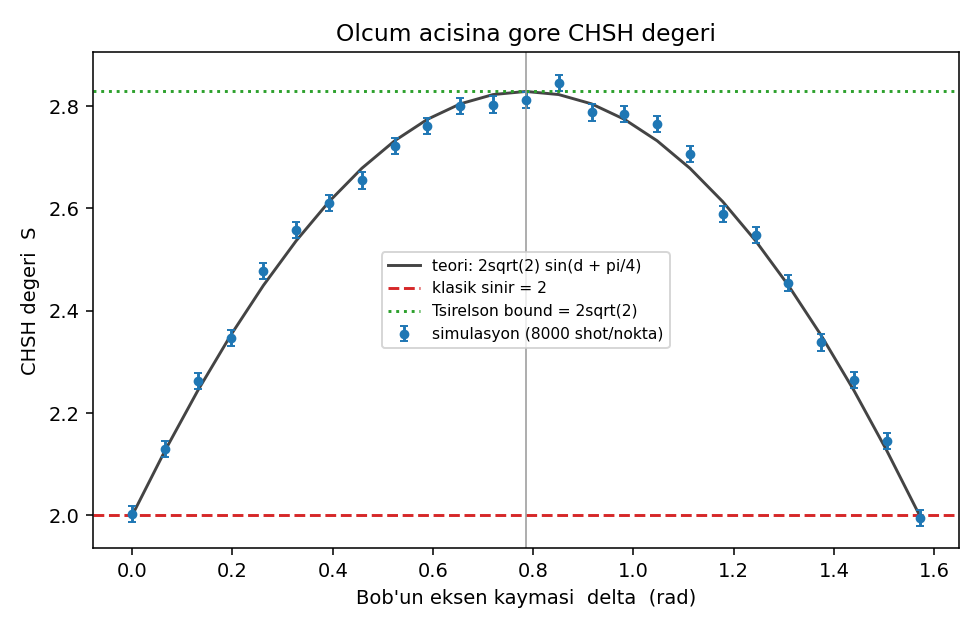
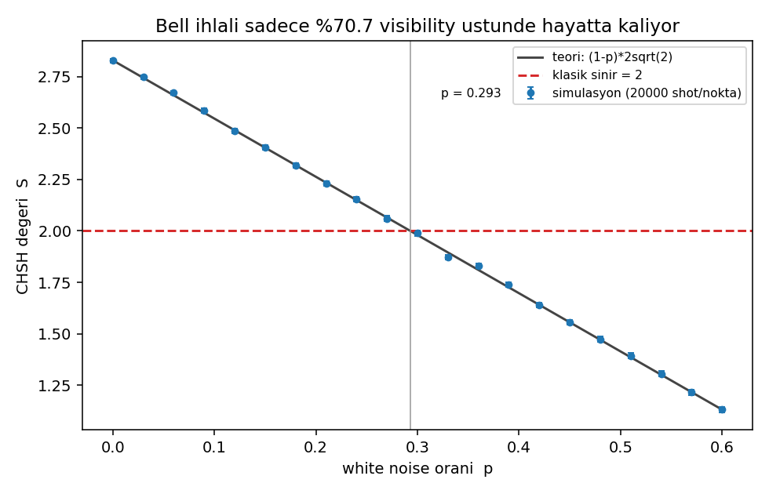

# Q# ile Bell Testi (CHSH)

Staj onboarding programı için yaptığım proje. Daha önce hiç quantum projesi
yapmamıştım, bu ilki.

Projede iki qubit'i entangle edip farklı açılardan ölçüyorum ve CHSH değeri
olan S'i hesaplıyorum. Klasik bir sistemde S en fazla 2 çıkabiliyor, entangle
qubit'lerle teoride 2.83'e kadar çıkıyor. Ben de bunu Q# ile kendim ölçmek
istedim.

## Neden Grover yerine CHSH

Programda önerilen proje Grover's search'tü ve ben de önce onu yapacaktım.
Sonra araştırırken CHSH testini gördüm ve bana daha ilginç geldi. Grover
quantum'un bir işi daha hızlı yaptığını gösteriyor, CHSH'de ise klasik bir
bilgisayarın hiç çıkaramayacağı bir sonuç çıkıyor. Biraz da herkesin yaptığı
şeyden farklı bir şey denemek istedim.

Bir de proje küçük: 2 qubit ve 40 satır civarı Q# yetiyor. İlk quantum
projem olduğu için bu işime geldi.

## Ne yaptım

İki qubit'i entangle ettikten sonra her birini seçtiğim bir açıdan ölçüyorum,
sonuç +1 ya da -1 çıkıyor. İki sonucu çarpıp ortalamasını alınca correlator
(E) çıkıyor. İkisi hep aynı çıkarsa E = 1, hep zıt çıkarsa E = -1 oluyor.

4 farklı açı kombinasyonu için 4 tane E ölçüp şu şekilde birleştiriyorum:

```
S = E(a0,b0) + E(a0,b1) + E(a1,b0) - E(a1,b1)
```

Klasik sınırın neden 2 olduğunu görmek için, sonuçlar baştan belli olsaydı
çıkabilecek 16 durumun hepsini hesapladım. Hiçbirinde 2'nin üstü çıkmıyor
(`results/classical_strategies.csv`).

Devre `src/CHSH.qs` içinde. Bell state hazırlama, istenen açıda ölçüm ve
kontrol için entangle olmayan bir çift hazırlama var. Geri kalan her şey
(ortalama, hata payı, grafikler) `experiment.py` içinde Python'da.

## Çalıştırma

VS Code + Azure Quantum Development Kit extension ile local simulator'da
çalıştırdım.

```bash
python -m pip install -r requirements.txt
python experiment.py
```

1 dakika kadar sürüyor. Sonuçlar `results/` klasörüne yazılıyor, orada
`SONUCLAR.md` diye kısa bir özet de var.

## Sonuçlar

Her correlator için 100.000 shot ile:

| Durum | S |
|---|---:|
| Bell state (entangled) | 2.83 ± 0.005 |
| Product state (entangle değil) | 1.42 ± 0.006 |

Entangle qubit'lerle 2'nin üstüne çıkıyor. Quantum'da da bir tavan var
(Tsirelson bound, 2.828), sonuç onunla da uyumlu. Entangle olmayan çift ise
1.42'de kalıyor, yani 2'yi geçmeyi sağlayan şey entanglement.

Ana ölçümden önce devrenin doğru çalışıp çalışmadığını birkaç açıda teorik
değerlerle karşılaştırarak kontrol ettim, hepsi tuttu. Sonra birkaç şey daha
denedim:

- Açıları değiştirince S'in nasıl değiştiğine baktım, en yüksek değer π/4'te
  çıktı.
- Sonuçlara rastgele gürültü ekledim. Sinyal %70 civarının altına düşünce
  qubit'ler hâlâ entangle olsa bile 2 geçilemiyor. Gerçek donanımda bu
  testin neden zor olduğunu burada anladım.
- Shot sayısını değiştirdim. 100 shot bile 2'yi geçmeye yetiyor, shot
  arttıkça sadece hata payı küçülüyor.




## Takıldığım yerler

Q# sadece Z ekseninde ölçüm yapıyor. Başka açıdan ölçmek için önce qubit'i
`Ry` ile döndürmek gerekiyormuş, bunu anlamam biraz sürdü. Dönme yönünü de
ilk başta ters yazmışım, teorik değerle karşılaştırınca fark ettim.

S formülünde eksi işaretini yanlış terime koymuştum, sonuç 0 çıktı. Hangi
terimin çıkarılması gerektiğini bulunca düzeldi.

Entangle olmayan çiftin 0 vermesini bekliyordum ama 1.41 çıktı. Biraz
araştırınca bunun bir kısmının zaten açılardan geldiğini, 2'nin üstündeki
kısmın ise ancak entanglement ile çıkabildiğini öğrendim.

## Neler öğrendim

İlk quantum projem olduğu için çoğu şey yeniydi. En çok işime yarayanlar:
Q#'ta Bell state hazırlamak ve kontrol etmek, rotation ile farklı eksende
ölçmek, olasılıklı sonuçları çok sayıda shot ve hata payıyla ölçmek, bir de
gürültünün sonucu ne kadar kolay bozduğunu görmek.

Sadece simulator'da denedim. İleride gerçek bir quantum donanımında veya
daha gerçekçi bir gürültü modeliyle denemek istiyorum.
