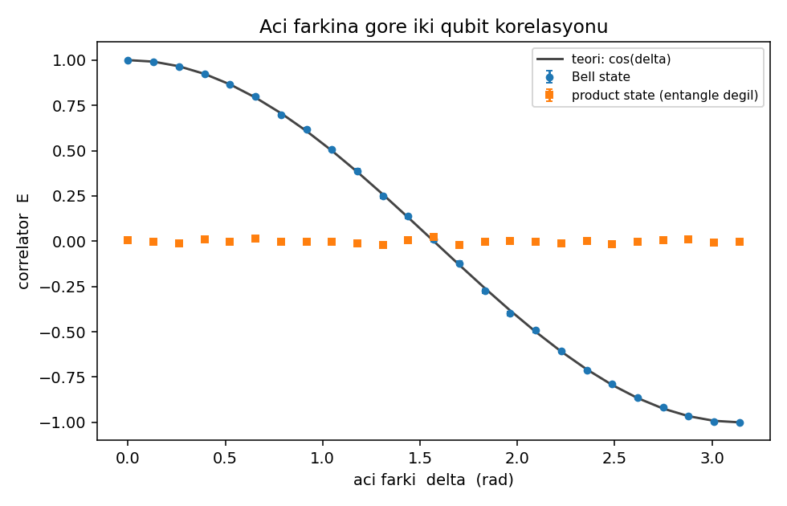
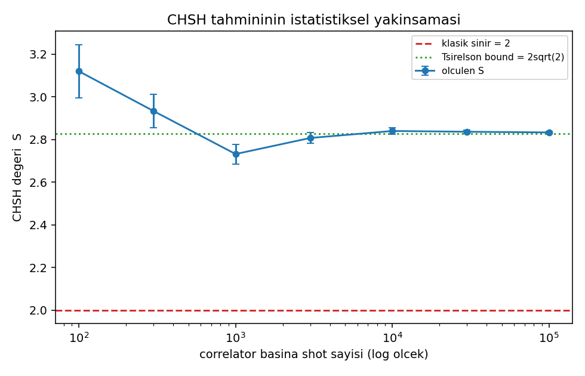

# Q# ile Bell Testi (CHSH Eşitsizliği)

Bu proje, iki qubit entangle edildiğinde klasik fizikle açıklanamayan bir
korelasyon ürettiğini ölçüyor. Quantum devre **Q#** ile yazıldı, ölçüm
sonuçlarının analizi ve grafikleri **Python** tarafında yapıldı.

Staj onboarding programı kapsamında hazırladığım giriş seviyesi bir proje.

## Neden bu konuyu seçtim

Başlangıçta Grover's search yapacaktım ama CHSH testi bana daha ilginç geldi.
Grover "quantum daha hızlı" diyor. CHSH ise **klasik bir bilgisayarın asla
üretemeyeceği bir sayı** üretiyor. Üstelik bunun sınırı tahmin değil, kesin:
klasik sistemlerde en fazla 2 çıkabiliyor ve bu 16 ihtimali tek tek yazarak
ispatlanabiliyor.

Bir de proje küçük kalıyor: 2 qubit ve yaklaşık 40 satır Q# yetiyor.

## Ana fikir

İki qubit'i entangle edip ayırıyorum. Her birini ölçüyorum, sonuç `+1` veya
`-1` çıkıyor.

Her ölçümde bir **açı** seçiyorum — qubit'e hangi eksenden baktığım. İki ölçüm
sonucunu çarpıp ortalamasını alıyorum. Buna correlator deniyor, `E` ile
gösteriliyor:

- İkisi hep aynı çıkıyorsa `E = +1`
- İkisi hep zıt çıkıyorsa `E = -1`
- Alakasızlarsa `E = 0`

Dört farklı açı kombinasyonu için dört tane `E` ölçüyorum. Üçünü toplayıp
birini çıkarıyorum:

```
S = E(a0,b0) + E(a0,b1) + E(a1,b0) - E(a1,b1)
```

### Klasik sınır neden 2

Diyelim ki ölçüm sonuçları aslında baştan belliydi, yani qubit'lerin içinde bir
cevap listesi vardı ve ben sadece okudum. O zaman elimde dört tane `+1/-1`
sayısı var: `A0, A1, B0, B1`.

Bu dört sayıyla `S` hesaplanınca sadece `-2`, `0` veya `+2` çıkabiliyor. 16
ihtimalin hepsi `results/classical_strategies.csv` dosyasında.

Önceden anlaşıp ortak rastgele bir plan yapsalar bile durum değişmiyor, çünkü
o sadece bu 16 durumun ortalaması olur ve ortalama uçlardan büyük olamaz.

Yani: **sonuçlar önceden belliyse S ≤ 2.**

### Quantum ne veriyor

Bell state kullanınca teorik olarak `S = 2√2 ≈ 2.83` çıkıyor. Buna Tsirelson
bound deniyor, quantum mekaniğinin kendi tavanı. Ben `2.8315` ölçtüm.

## Devre nasıl çalışıyor

Q# tarafı (`src/CHSH.qs`) sadece 4 şey yapıyor:

1. `PrepareBellPair` — `H` ve `CNOT` ile entangle çift hazırlıyor
2. `MeasureAtAngle` — Q# sadece Z ekseninde ölçebiliyor, o yüzden önce
   `Ry(-theta)` ile istediğim ekseni Z'ye çeviriyorum, sonra ölçüyorum
3. `SampleCorrelation` — bir deneme yapıp iki sonucun çarpımını döndürüyor
   (`Zero` → `+1`, `One` → `-1`)
4. `PrepareProductPair` — kontrol için entangle **olmayan** bir çift hazırlıyor

Ortalama alma, hata payı hesabı, açı taraması gibi işler tamamen klasik
işlemler olduğu için Python'da (`experiment.py`).

## Kurulum ve çalıştırma

```bash
python -m pip install -r requirements.txt
python experiment.py
```

Program `results/` klasörüne CSV tabloları, PNG grafikleri ve Türkçe bir özet
dosyası (`SONUCLAR.md`) yazıyor. Çalışması yaklaşık 1 dakika sürüyor.

VS Code + Azure Quantum Development Kit extension ile yerel simulator üzerinde
test edildi. Gerçek donanım veya Azure aboneliği gerekmiyor.

## Sonuçlar

Simulator sabit seed kullanmadığı için her çalıştırmada rakamlar biraz
oynuyor. Aşağıdakiler bir tam çalıştırmadan alındı.

### Ana ölçüm (correlator başına 100.000 shot)

| Durum | S | Hata payı | İhlal |
|---|---:|---:|:--:|
| Bell state (entangled) | **2.8315** | 0.0045 | var |
| Product state (entangle değil) | 1.4190 | 0.0055 | yok |

| | |
|---|---:|
| Klasik sınır | 2.0000 |
| Tsirelson bound (2√2) | 2.8284 |
| Klasik sınırdan uzaklık | 186 sigma |

Entangle olmayan kontrol durumu `1.419` veriyor. Teorik değeri `√2 ≈ 1.4142`,
yani tutuyor. Burası önemli: kontrol sıfır değil ama sınırın altında. Demek ki
`S`'i 2'nin üstüne taşıyan şey ölçüm düzeni değil, entanglement'ın kendisi.

### Devre doğrulaması

Ölçmeye başlamadan önce devrenin doğru çalıştığını kontrol ettim. Teorik olarak
`E(a,b) = cos(a-b)` çıkması gerekiyor:

| delta | Teori | Ölçülen | Hata payı |
|---|---:|---:|---:|
| 0 | +1.0000 | +1.0000 | 0.0000 |
| pi/4 | +0.7071 | +0.7019 | 0.0050 |
| pi/2 | 0.0000 | -0.0002 | 0.0071 |
| 3pi/4 | -0.7071 | -0.7006 | 0.0050 |
| pi | -1.0000 | -1.0000 | 0.0000 |

Hepsi hata payı içinde.

### Shot sayısının etkisi

| Shot | S | Hata payı | Sınırın kaç sigma üstünde |
|---:|---:|---:|---:|
| 100 | 3.1200 | 0.1256 | 8.9 |
| 1.000 | 2.7320 | 0.0462 | 15.8 |
| 10.000 | 2.8400 | 0.0141 | 59.6 |
| 100.000 | 2.8333 | 0.0045 | 186.6 |

100 shot bile klasik sınırı aşmaya yetiyor. Fazla shot sonucu değiştirmiyor,
sadece hata payını küçültüyor.

### Gürültü eşiği

Ölçümlerin `p` kadarlık kısmını rastgele sonuçla değiştirdiğimde her correlator
`(1-p)` ile çarpılıyor, yani `S = (1-p)·2√2`. İhlalin kaybolduğu nokta:

```
(1-p)·2√2 = 2   →   1-p = 1/√2 ≈ 0.707
```

Yani visibility **%70.7**'nin altına inerse test geçilemiyor. Durum hâlâ
entangle olsa bile. Gerçek Bell deneylerinin neden zor olduğu bu.

## Grafikler

### Ölçüm açısına göre S


### Entangled ve separable karşılaştırması


### Gürültü eşiği


### Shot sayısına göre yakınsama


## Takıldığım yerler

- **Ölçüm açısını uygulamak.** Q# sadece Z ekseninde ölçüyor. İstediğim eksende
  ölçmek için önce `Ry(-theta)` uygulamak gerektiğini anlamam biraz sürdü.
  Dönme yönünün işaretini de karıştırdım, `E(0, pi/4)` değerini `cos(pi/4)` ile
  karşılaştırıp düzelttim.

- **İşaret hatası.** İlk denemede formülü `E(a0,b0) - E(a0,b1) + E(a1,b0) +
  E(a1,b1)` yazdım ve `S = 0` çıktı. Eksi işareti son terime ait; dört terimin
  üçü birbirini desteklemeli, biri ters gitmeli.

- **Yanlış teorik eğri.** Açı taraması için teorik formülü önce
  `3cos(d) - cos(3d)` yazmıştım. `d = 0` ve `d = pi/4` noktalarında doğru
  sonucu verdiği için doğru sandım, ama `d = pi/2`'de tutmuyor. Doğrusu
  `2(cos d + sin d)`. Kontrol ettiğim iki noktada uyması doğrulama değilmiş.

- **Kontrol durumunun sıfır çıkmaması.** Product state'in `S = 0` vermesini
  bekliyordum, `1.41` çıktı. Nedenini araştırınca `S`'in bir kısmının zaten
  sıradan ölçüm geometrisinden geldiğini, sadece 2'yi aşan kısmın entanglement
  gerektirdiğini anladım.

- **Tavanın üstünde değer çıkması.** Bazı çalıştırmalarda `S`, Tsirelson bound
  olan `2.8284`'ün biraz üstünde çıkıyor (mesela 100 shot'ta `3.12`). Bu
  fiziksel bir aşım değil, az örneklemden gelen gürültü. Açı taramasında da
  benzer bir durum var: 25 gürültülü ölçümün en büyüğünü seçmek o değeri yukarı
  kaydırıyor.

## Neler öğrendim

- Q#'ta Bell state hazırlamayı ve doğrulamayı
- Sadece Z ekseninde ölçüm yapabilen bir sistemde istediğin ekseni nasıl
  ölçeceğini
- Klasik sınırın nasıl ispatlandığını ve ortak rastgeleliğin neden yardım
  etmediğini
- Olasılıksal bir sonucu shot tekrarıyla ölçüme, hata payıyla da savunulabilir
  bir iddiaya nasıl çevireceğini
- Tsirelson bound'un ne olduğunu ve onu aşan bir değerin neden hata olduğunu
- Gürültünün ihlali nasıl yok ettiğini

## Sınırlamalar

İdeal simulator kullanıldı, yani gerçek Bell deneylerindeki detection ve
locality loophole'ları burada yok. Gürültü modeli gate seviyesinde değil,
sonuçlara klasik olarak eklenen basit bir white noise. Sadece maximally
entangled state ve X–Z ölçüm düzlemi denendi.

## Sonraki adımlar

Kısmi entangle state'lerle `S`'in nasıl düştüğüne bakılabilir. Aynı sonuç CHSH
oyunu şeklinde de yazılabilir — klasik kazanma oranı %75, quantum %85.4. Gate
seviyesinde gürültü modeli veya gerçek donanım denemesi de mümkün.

## Dosyalar

```
CHSH-Bell/
├── README.md
├── requirements.txt
├── experiment.py
├── qsharp.json
├── src/
│   └── CHSH.qs
└── results/
    ├── SONUCLAR.md          ← Türkçe özet, program üretiyor
    ├── *.csv                ← sayısal tablolar
    └── *.png                ← grafikler
```
